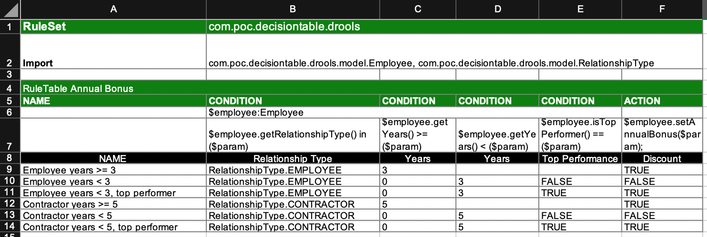

## Decision Table on Drools

This project demonstrates the possibility of building the business person friendly decision table and running it by using Drools Rules Engine.

The decision table is composed within an Excel and looks like:



Once compiled by Drools Engine the decision table is presented in form of DRL rules:
```
package com.poc.decisiontable.drools;
//generated from Decision Table
import com.poc.decisiontable.drools.model.Employee;
import com.poc.decisiontable.drools.model.RelationshipType;
// rule values at A9, header at A4
rule "Employee years >= 3"
	when
		$employee:Employee($employee.getRelationshipType() in (RelationshipType.EMPLOYEE), $employee.getYears() >= (3))
	then
		$employee.setAnnualBonus(true);
end

// rule values at A10, header at A4
rule "Employee years < 3"
	when
		$employee:Employee($employee.getRelationshipType() in (RelationshipType.EMPLOYEE), $employee.getYears() >= (0), $employee.getYears() < (3), $employee.isTopPerformer() == (false))
	then
		$employee.setAnnualBonus(false);
end

// rule values at A11, header at A4
rule "Employee years < 3, top performer"
	when
		$employee:Employee($employee.getRelationshipType() in (RelationshipType.EMPLOYEE), $employee.getYears() >= (0), $employee.getYears() < (3), $employee.isTopPerformer() == (true))
	then
		$employee.setAnnualBonus(true);
end

// rule values at A12, header at A4
rule "Contractor years >= 5"
	when
		$employee:Employee($employee.getRelationshipType() in (RelationshipType.CONTRACTOR), $employee.getYears() >= (5))
	then
		$employee.setAnnualBonus(true);
end

// rule values at A13, header at A4
rule "Contractor years < 5"
	when
		$employee:Employee($employee.getRelationshipType() in (RelationshipType.CONTRACTOR), $employee.getYears() >= (0), $employee.getYears() < (5), $employee.isTopPerformer() == (false))
	then
		$employee.setAnnualBonus(false);
end

// rule values at A14, header at A4
rule "Contractor years < 5, top performer"
	when
		$employee:Employee($employee.getRelationshipType() in (RelationshipType.CONTRACTOR), $employee.getYears() >= (0), $employee.getYears() < (5), $employee.isTopPerformer() == (true))
	then
		$employee.setAnnualBonus(true);
end
```